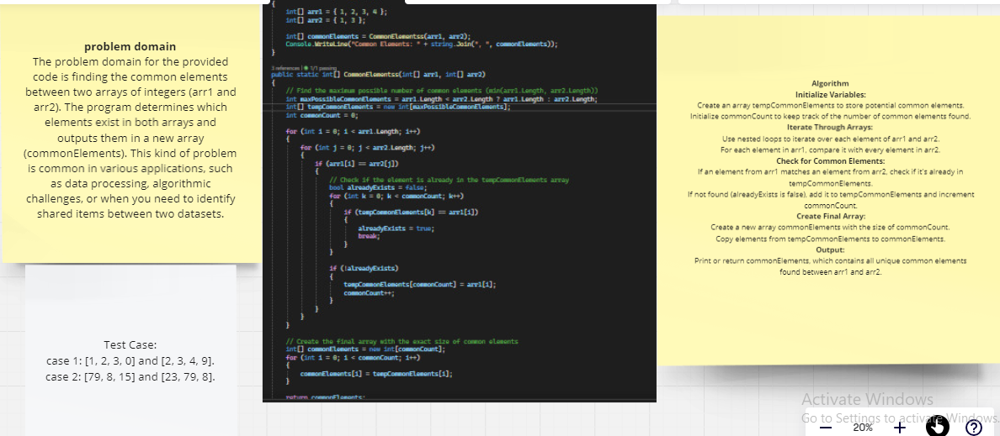
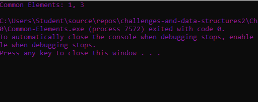

# Find Common Elements in Two Arrays Challenge

## Challenge Description:
function called CommonElementss that accepts two arrays of integers as its parameters. Without utilizing any built-in methods, the function should return a new array containing the common elements between the two input arrays.
### The whiteboard image

### output:
