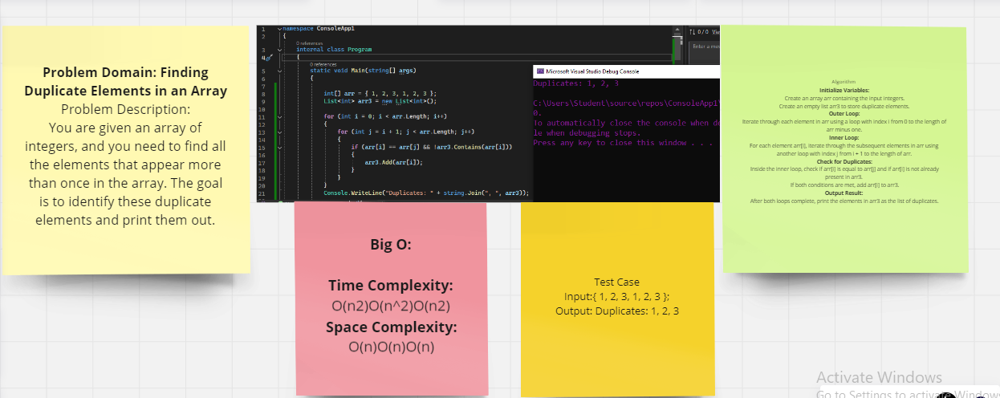

# Find Duplicates Challenge

## Challenge Description:
function called FindAndPrintDuplicates that accepts an array as its parameter. The function returns an array containing duplicate values found in the input array, without using any built-in methods provided by the language.

### The whiteboard image

### output:
