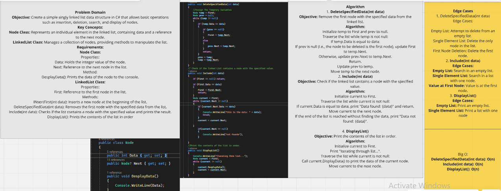
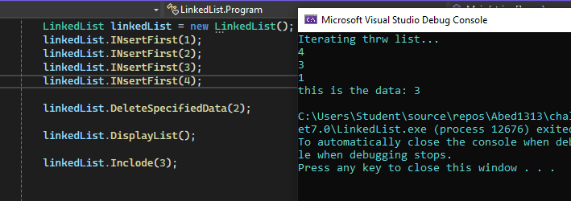

# Linked List Implementation Challenge

## Challenge Description:
This code implements a simple singly linked list data structure in C#. It consists of two main classes: Node and LinkedList. The Node class represents an element in the linked list, while the LinkedList class manages a collection of these nodes and provides methods to manipulate the list.### The whiteboard image

### output:
