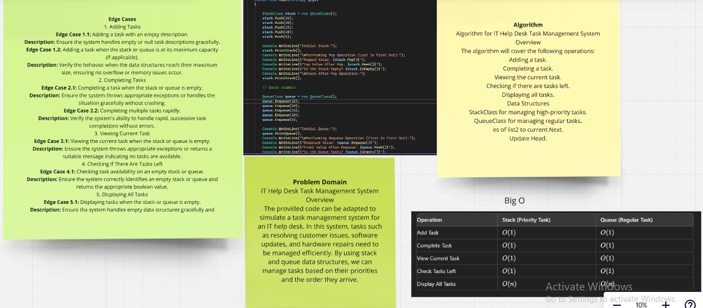
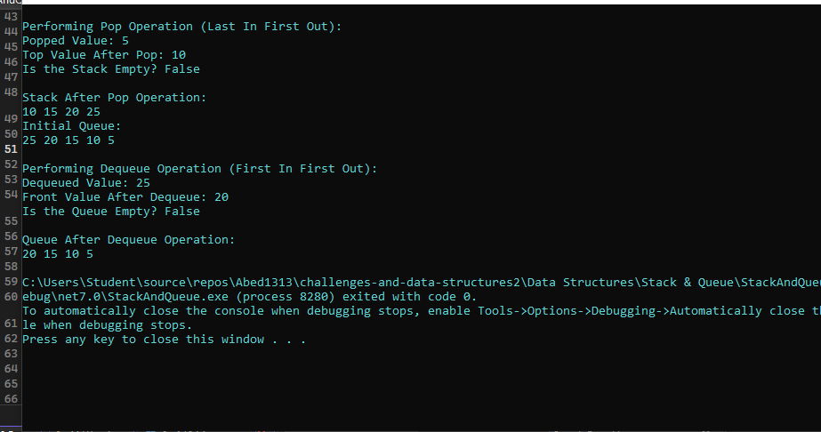

# Stack and Queue Implementation Challenge

## Challenge Description:
The IT Help Desk Task Management System is a simple console application designed to help manage and prioritize tasks within an IT help desk environment. The system uses two primary data structures: a stack for high-priority tasks and a queue for regular tasks. This ensures that high-priority tasks are handled first (LIFO - Last In, First Out), while regular tasks are managed in the order they arrive (FIFO - First In, First Out).
### Whiteboard:

### output:
